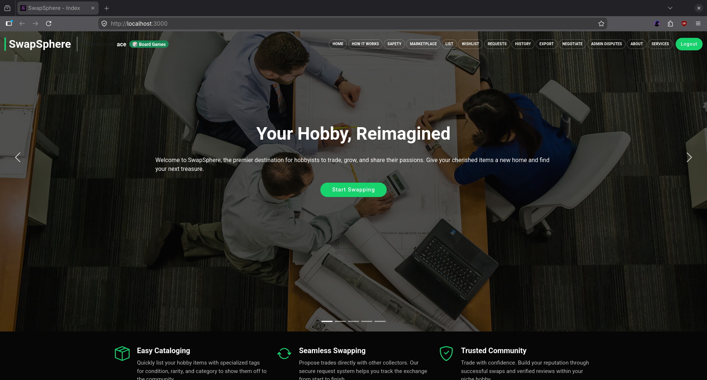

# SwapSphere

A full-stack MERN (MongoDB, Express.js, React, Node.js) application for hobbyists to list items, propose swaps, negotiate in-app, and build community trust through reviews and karma.



Access the website live from: [https://swapsphere-theta.vercel.app/](https://swapsphere-theta.vercel.app/)

## Features

- **Item Listing Creation:** Users can add new hobby items with a title and description.
- **Condition Tagging:** Assigning a specific condition status (e.g., "Mint," "Used," "Rare") to items.
- **Availability Toggle:** Ability to mark an item as "Available for Swap" or "Private Collection" without deletion.
- **Categorical Filtering:** Filtering the marketplace by hobby sub-categories.
- **Keyword Search:** A search bar to find specific items by name or tags.
- **Wishlist Addition:** Users can save items of interest to a personal "Watchlist."
- **Initiate Swap Request:** Sending a formal request to another user to trade specific items.
- **Incoming Request Manager:** A dedicated view for users to track all pending requests sent to them.
- **Acceptance Workflow:** Logic that marks a swap as "Accepted" and automates the status change of the items involved.
- **Transaction History:** A persistent log of all successfully completed swaps for a user.
- **Reputation System (Karma Points):** A numerical score on user profiles that increases with successful, honest swaps to build community trust.
- **Hobby-Niche Badges:** Automated visual badges (e.g., "Retro King" or "Card Pro") awarded based on the type of item the user mostly associates with.
- **User Reviews & Ratings:** Post-swap feedback where hobbyists can leave a star rating and a brief comment about their trade partner.
- **"Smart Match" Suggestions:** An algorithm that suggests items to a user based on their Wishlist and the items they currently have "Available for Swap."
- **Multi-Item Bundle Swaps:** Logic allowing a user to offer two or more low-value items in exchange for one high-value "Rare" item.
- **Geo-Location Tagging:** Optional location-based tagging to help hobbyists find local swap meets or trade partners nearby for in-person exchanges.
- **In-App Negotiation Chat:** A dedicated messaging system linked to a specific Swap Request where users can discuss item conditions or logistics.
- **Real-Time Notifications:** Push or in-app alerts for new "Incoming Requests" or when an item on a user's Wishlist becomes available.
- **Admin Dispute Resolution Portal:** A view for Administrators to review flagged transactions or reports of "Used" items being falsely labeled as "Mint."
- **Inventory Export:** A feature allowing hobbyists to export their "Private Collection" or transaction history into a PDF or CSV format for personal record-keeping.
- **Hobby-Specific Condition Checklists:** A dynamic form system that generates unique attribute fields based on the item category (e.g., "Holographic" for cards or "Hardcover" for books) to ensure professional-grade descriptions.
- **Supplementary Pages and UI Improvements:** Additional pages with descriptive information on how to use the “SwapSphere” platform to start their trading journey. Fixed various plain and broken UI designs, and replaced them with more robust variants.

## Tech Stack

- **Frontend:** React.js, Bootstrap CSS
- **Backend:** Node.js, Express.js
- **Database:** MongoDB
- **Authentication:** JWT (JSON Web Tokens)
- **Realtime:** Socket.IO (notifications, negotiation chat)

## Prerequisites

Before running this application, make sure you have the following installed:

- Git
- Node.js (v14 or higher)
- npm or yarn
- MongoDB Compass (optional but recommended)

## Installation

1. Clone the repository:
   ```bash
   git clone <repository-link>
   cd SwapSphere
   ```

2. Install dependencies for both client and server:
   ```bash
   npm run install-all
   ```

## Environment Variables

Edit the given `.env` template file in the root directory and add the following variables:

```env
MONGO_URI=your_mongodb_connection_string
PORT=5000
JWT_SECRET=your_super_secret_jwt_key_here
```

- `MONGO_URI`: Your MongoDB connection string (local or Atlas)
- `PORT`: Port for the backend server (default: 5000)
- `JWT_SECRET`: Secret key for JWT token generation (default: given value)

## Running the Application

1. Ensure MongoDB is running (local or Atlas).

2. Start the server:
   ```bash
   npm start
   ```
   This starts both the backend server and React frontend concurrently.

The application will be available at:

- Frontend: http://localhost:3000
- Backend API: http://localhost:5000

## API Endpoints

### Authentication

- `POST /api/auth/register` — User registration
- `POST /api/auth/login` — User login

(Additional routes are defined under `backend/routes/` for items, swaps, messages, disputes, export, stats, and admin.)

## Project Structure

```
SwapSphere/
├── backend/
│   ├── controllers/
│   │   ├── authController.js
│   │   ├── messageController.js
│   │   └── swapController.js
│   ├── middleware/
│   │   ├── admin.js
│   │   └── auth.js
│   ├── models/
│   │   ├── Dispute.js
│   │   ├── Item.js
│   │   ├── Message.js
│   │   ├── Review.js
│   │   ├── SwapRequest.js
│   │   └── User.js
│   ├── routes/
│   │   ├── admin.js
│   │   ├── auth.js
│   │   ├── disputes.js
│   │   ├── export.js
│   │   ├── items.js
│   │   ├── messages.js
│   │   ├── stats.js
│   │   └── swapRoutes.js
│   ├── server.js
│   ├── package.json
│   └── uploads/                 # User-uploaded listing images (created at runtime)
├── client/
│   ├── public/
│   │   ├── index.html
│   │   └── assets/              # Static template assets (CSS, images)
│   ├── src/
│   │   ├── components/
│   │   │   ├── admin/
│   │   │   │   └── AdminDisputesPage.jsx
│   │   │   ├── swaps/
│   │   │   │   ├── IncomingRequestManager.jsx
│   │   │   │   ├── ProposeSwapPage.jsx
│   │   │   │   ├── ReviewForm.jsx
│   │   │   │   ├── SwapModal.jsx
│   │   │   │   └── TransactionHistory.js
│   │   │   ├── About.js
│   │   │   ├── ConditionChecklist.js
│   │   │   ├── CreateListing.js
│   │   │   ├── ExportPage.jsx
│   │   │   ├── FeaturedServices.js
│   │   │   ├── Header.js
│   │   │   ├── Hero.js
│   │   │   ├── HobbyBadge.js
│   │   │   ├── HowItWorks.jsx
│   │   │   ├── ItemGallery.js
│   │   │   ├── Login.js
│   │   │   ├── NegotiationHub.js
│   │   │   ├── Register.js
│   │   │   ├── Safety.js
│   │   │   ├── Services.js
│   │   │   ├── Stats.js
│   │   │   └── Wishlist.js
│   │   ├── config/
│   │   │   └── api.js
│   │   ├── App.js
│   │   ├── App.css
│   │   ├── index.js
│   │   └── index.css
│   └── package.json
├── package.json                 # Root scripts (concurrent client + server)
├── package-lock.json
├── LICENSE
└── README.md
```

The `client/build/` directory is produced by `npm run build` and is omitted above.

## Contributors

- [Shahed Ahmed](https://github.com/shahedahmed0)
- [Iftekharul Hakim](https://github.com/hakimiftekharul)
- [Shugofta Anjum](https://github.com/shugofta)

## Contributing

1. Fork the repository
2. Create a feature branch (`git checkout -b feature/AmazingFeature`)
3. Commit your changes (`git commit -m 'Add some AmazingFeature'`)
4. Push to the branch (`git push origin feature/AmazingFeature`)
5. Open a Pull Request

## License

This project is licensed under the MIT License.
